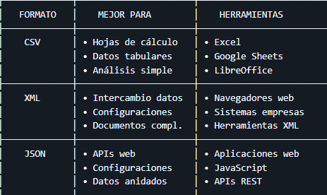

### ¿Por qué exportar datos?

En el desarrollo de aplicaciones, frecuentemente necesitamos:

📤 **Exportar datos** para que otros sistemas los consuman  
📊 **Generar informes** legibles para usuarios  
🔄 **Intercambiar información** entre aplicaciones  
💾 **Crear copias de seguridad** en formatos estándar  
📈 **Analizar datos** en herramientas especializadas

### Los tres formatos más comunes

