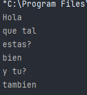

## Introducción

Cuando un programa finaliza su ejecución, toda la información almacenada en memoria RAM se pierde. Para conservar los datos entre distintas ejecuciones, es necesario **almacenarlos de forma persistente**.

Una de las formas más sencillas y universales de persistencia es el **uso de ficheros**, que permiten guardar información en disco duro, ya sea en forma de texto plano, binario o estructurado (como XML).

En este tema aprenderás qué tipos de acceso existen a un fichero, qué papel juega el sistema de ficheros del sistema operativo, y cómo Java gestiona este acceso mediante sus clases estándar.

### 1. ¿Qué es un fichero?

Un fichero (o archivo) es una **secuencia de bytes almacenada de forma persistente** en un dispositivo de almacenamiento. Se identifica mediante una ruta o «path», y puede contener cualquier tipo de información: texto, imágenes, objetos, etc.

Los ficheros son gestionados por el **sistema de archivos** del sistema operativo, el cual se encarga de:

- Asignar una ruta y un nombre único dentro de un directorio.

- Proteger el acceso concurrente mediante permisos.

- Garantizar la integridad de los datos.

### 2. Acceso a la información: Tipos
#### **Acceso secuencial**: se lee el fichero de principio a fin, útil para textos planos.

Este es el modo más **básico y común** de acceder a ficheros de texto. Se lee el archivo **desde el principio hasta el final**, **línea a línea o carácter a carácter**, en orden.

##### Ventajas:

- Simple de implementar.
- Ideal para archivos pequeños o de lectura completa (como logs, listas, etc).


##### Inconvenientes:

- No se puede «saltar» directamente a una línea concreta.
- Poco eficiente si solo necesitas una parte específica del archivo.

```java
import java.io.*;  
  
public class LecturaSecuencial {  
    public static void main(String[] args) throws IOException {  
        BufferedReader br = new BufferedReader(new FileReader("datos.txt"));  
        String linea;  
  
        while ((linea = br.readLine()) != null) {  
            System.out.println(linea);  
        }  
  
        br.close();  
    }  
}
```



Este programa lee el archivo **línea por línea** hasta que ya no queden más (cuando `readLine()` devuelve `null`).


#### **Acceso aleatorio (Random Access)**: permite saltar a una posición específica del archivo, ideal para estructuras binarias.

Este modo permite **acceder directamente a una posición específica del archivo**, sin tener que recorrerlo desde el principio.

Para ello se usa la clase `RandomAccessFile`, que funciona como una combinación de lector y escritor. Se puede mover el «puntero» a cualquier parte del archivo con `.seek(posicion)`.

##### Ventajas:

- Muy útil en estructuras con **registros de tamaño fijo**.
- Permite **lectura y escritura en cualquier parte del archivo**.

##### Inconvenientes:

- Solo se puede usar en ficheros de tipo binario o texto con estructuras muy controladas.
- Requiere conocer la estructura exacta del contenido.
```java
import java.io.*;  
  
public class AccesoAleatorio {  
    public static void main(String[] args) throws IOException {  
        RandomAccessFile raf = new RandomAccessFile("datos.txt","rw");  
        raf.seek(20); // Mover el puntero a la posición 20 (byte 20)  
        String linea = raf.readLine(); // Leer desde ahí  
        System.out.println("Contenido desde byte 20: " + linea);  
  
        raf.close();  
    }  
}
```
**Nota**: La posición 20 significa el **byte número 20**, no la línea 20. Para acceder por líneas habría que recorrerlas.
![[fotoAccesoAleatorio.png]]

#### Resumen comparativo

| Característica  | Acceso Secuencial              | Acceso Aleatorio (`RandomAccessFile`)   |
| --------------- | ------------------------------ | --------------------------------------- |
| Tipo de lectura | Desde el inicio hasta el final | Desde una posición específica           |
| Lectura parcial | ❌ No directa                   | ✅ Sí                                    |
| Escritura       | ✅ Sí, al final normalmente     | ✅ Sí, en cualquier posición             |
| Clase principal | `BufferedReader`, `Scanner`    | `RandomAccessFile`                      |
| Ideal para      | Archivos de texto              | Archivos binarios o con registros fijos |

### 3. Sistema de ficheros y rutas

#### ¿Qué es una ruta?

Una **ruta** es el camino que el sistema operativo necesita para acceder a un archivo o carpeta.

En Java, al trabajar con ficheros, es necesario indicar la **ruta completa** del archivo al que queremos acceder, ya sea para **leerlo**, **escribirlo**, **modificarlo** o **eliminarlo**.

#### Tipos de rutas en Java

Están las rutas Absolutas y Relativas
#### **Absolutas**: especifican todo el camino desde la raíz del sistema.

Es la ruta **completa** desde el origen del sistema de archivos (la raíz).

- En **Windows**:

    `C:\\Users\\David\\Documentos\\datos.txt`

**Ventaja**: Es muy precisa.

**Desventaja**: No es portable entre sistemas ni usuarios.

#### **Relativas**: se refieren a la ubicación del archivo respecto al directorio actual del programa.

Es la ruta en relación al **directorio actual del proyecto Java** (es decir, el «working directory»).

Por ejemplo, si nuestro proyecto está en:

`C:/Users/David/IdeaProjects/AccesoADatos/`

Y usamos la ruta relativa:

`datos/alumnos.txt`

Java buscará el archivo en:

``C:/Users/David/IdeaProjects/AccesoADatos/datos/alumnos.txt``

**Ventaja**: Es portable entre sistemas y ordenadores.

**Desventaja**: Puede ser difícil de localizar si no se sabe cuál es el directorio actual.

#### Cómo obtener el directorio actual del proyecto

```java
String base = System.getProperty("user.dir");
System.out.println("Ruta base del proyecto: " + base);
```

#### Portabilidad con `File.separator`

Los separadores de carpetas son diferentes según el sistema operativo:

- Windows → `\\`

- Linux/Mac → `/`


En lugar de escribirlo manualmente, usamos:
```java
String separador = File.separator;
```
#### Ejemplo completo
```java
import java.io.File;  
public class RutasEjemplo {  
    public static void main(String[] args) {  
        String base = System.getProperty("user.dir");  
        String sep = File.separator;  
  
        String rutaAbsoluta = base + sep + "datos" + sep + "ejemplo.txt";  
        System.out.println("Ruta absoluta generada: " + rutaAbsoluta);  
  
        File archivo = new File(rutaAbsoluta);  
        System.out.println("¿Existe el archivo? " + archivo.exists()); 
    }  
}
```
Este código construye una ruta de forma **portátil** y verifica si el archivo existe.
![[Pasted image 20250930124322.png]]
Esto es porque no existe la carpeta datos ni el archivo dentro, si lo creo, pondrá true.
![[Pasted image 20250930124453.png]]
Ahora que lo he creado, ya sale como true

## Ejemplo práctico completo
```java
import java.io.*;  
public class GuardarLeerTexto {  
    public static void main(String[] args) throws IOException {  
        String ruta = System.getProperty("user.dir") + File.separator + "ejemplo.txt";  
  
        // Escritura  
        BufferedWriter bw = new BufferedWriter(new FileWriter(ruta));  
        bw.write("Primera línea\n");  
        bw.write("Segunda línea\n");  
        bw.close();  
  
        // Lectura  
        BufferedReader br = new BufferedReader(new FileReader(ruta));  
        String linea;  
        while ((linea = br.readLine()) != null) {  
            System.out.println(linea);  
        }  
        br.close();  
    }  
}
```

![[Pasted image 20250930125059.png]]

## Tabla comparativa: Acceso secuencial vs aleatorio

| Característica       | Acceso Secuencial          | Acceso Aleatorio                   |
| -------------------- | -------------------------- | ---------------------------------- |
| Tipo de uso          | Lectura lineal, texto      | Datos binarios estructurados       |
| Clases usadas        | FileReader, BufferedReader | RandomAccessFile                   |
| Velocidad de lectura | Lenta para datos al final  | Alta (si conoces la posición)      |
| Modificación         | Reescribir todo el archivo | Modificar por posiciones           |
| Uso de punteros      | No                         | Sí (`seek()` y `getFilePointer()`) |
| Consumo de memoria   | Bajo                       | Moderado                           |
