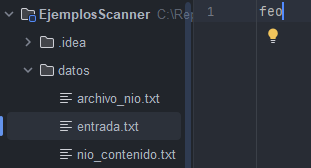
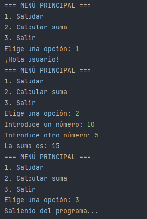

La clase **Scanner** en Java se usa para leer datos fácilmente, ya sea del teclado, archivos o cadenas de texto. Es muy cómoda porque te deja recoger tanto texto como números sin complicarte la vida con conversiones. Por eso se usa mucho en ejercicios, programas interactivos y proyectos donde hace falta pedir datos al usuario.


## Fundamentos de la clase `Scanner`

- Pertenece al paquete `java.util`.

- Permite leer datos de diferentes tipos (`int`, `double`, `String`, etc.).

- Se construye a partir de una fuente de entrada:
    - **Teclado**: `new Scanner(System.in)`
    
    - **Archivo**: `new Scanner(new File("ruta.txt"))`
    
    - **Cadena de texto**: `new Scanner("texto inicial")`


### Métodos principales de `Scanner`

|Método|Descripción|
|---|---|
|`next()`|Lee la siguiente palabra (hasta espacio)|
|`nextLine()`|Lee una línea completa|
|`nextInt()`|Lee un número entero|
|`nextDouble()`|Lee un número decimal|
|`hasNext()`|Devuelve `true` si hay más datos disponibles|
|`hasNextInt()`|Verifica si el siguiente token es un entero|
|`close()`|Cierra el objeto `Scanner`|

## Uso de Scanner para leer desde teclado

El caso más habitual en programas interactivos es leer datos desde teclado:

```java
import java.util.Scanner;  
public class EjemploScanner {  
    public static void main(String[] args) {  
        Scanner sc = new Scanner(System.in);  
  
        System.out.print("Introduce tu nombre: ");  
        String nombre = sc.nextLine();  
  
        System.out.print("Introduce tu edad: ");  
        int edad = sc.nextInt();  
  
        System.out.println("Hola " + nombre + ", tienes " + edad + " años.");  
  
        sc.close(); // Siempre cerrar al final  
    }  
}
```


### Observaciones importantes

- Es recomendable **cerrar siempre** el `Scanner` al final del programa.
    
- Si se mezclan `nextInt()` y `nextLine()`, es necesario limpiar el **buffer de entrada** con una llamada extra a `nextLine()`.


## Uso de Scanner para leer desde archivos

Además de leer del teclado, `Scanner` puede leer directamente desde archivos:
```java
import java.io.File;  
import java.util.Scanner;  
  
public class LeerArchivoScanner {  
    public static void main(String[] args) {  
        try {  
            File archivo = new File("datos/entrada.txt");  
            Scanner sc = new Scanner(archivo);  
  
            while (sc.hasNextLine()) {  
                String linea = sc.nextLine();  
                System.out.println("Línea: " + linea);  
            }  
  
            sc.close();  
        } catch (Exception e) {  
            System.out.println("Error al leer archivo: " + e.getMessage());  
        }  
    }  
}
```




Si no estuviera creada la carpeta datos y el archivo entrada.txt dentro daría error


### Ventajas frente a otras clases de lectura de archivos

- `Scanner` permite **leer tokens individuales** (palabras, números, etc.) fácilmente.
    
- Se pueden aplicar **separadores personalizados** con el método `useDelimiter()`.
    
- Sin embargo, para archivos muy grandes, `BufferedReader` suele ser más eficiente.


## Creación de menús interactivos con Scanner

Una aplicación típica en FP es la construcción de **menús de consola**.
```java
import java.util.Scanner;  
  
public class MenuEjemplo {  
    public static void main(String[] args) {  
        Scanner sc = new Scanner(System.in);  
        int opcion;  
  
        do {  
            System.out.println("=== MENÚ PRINCIPAL ===");  
            System.out.println("1. Saludar");  
            System.out.println("2. Calcular suma");  
            System.out.println("3. Salir");  
            System.out.print("Elige una opción: ");  
            opcion = sc.nextInt();  
  
            switch (opcion) {  
                case 1:  
                    System.out.println("¡Hola usuario!");  
                    break;  
                case 2:  
                    System.out.print("Introduce un número: ");  
                    int a = sc.nextInt();  
                    System.out.print("Introduce otro número: ");  
                    int b = sc.nextInt();  
                    System.out.println("La suma es: " + (a + b));  
                    break;  
                case 3:  
                    System.out.println("Saliendo del programa...");  
                    break;  
                default:  
                    System.out.println("Opción inválida.");  
            }  
        } while (opcion != 3);  
  
        sc.close();  
    }  
}
```




Este tipo de menús se utiliza como base en muchos proyectos de consola.

## Comparación con otras clases de entrada

|Clase|Ventajas|Inconvenientes|
|---|---|---|
|`Scanner`|Fácil de usar, soporta tipos primitivos|Más lento que `BufferedReader`|
|`BufferedReader`|Muy eficiente en lectura de texto|Necesita conversión manual de tipos|
|`FileReader`|Lectura directa de archivos|Requiere envoltorios (buffers)|

## Buenas prácticas al usar Scanner

- Cerrar siempre con `sc.close()` para liberar recursos.
    
- Si se usan métodos mixtos (`nextInt` y `nextLine`), limpiar el buffer.
    
- Para proyectos grandes, combinarlo con **clases POJO** para estructurar datos.
    
- Evitar su uso en **aplicaciones con ficheros enormes**, donde `BufferedReader` es más eficiente.


