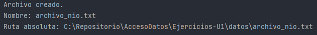
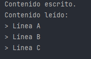

## Introducción

Java NIO (New Input/Output) es una API introducida en Java 7 que mejora significativamente el rendimiento y la flexibilidad en las operaciones de entrada/salida. A diferencia de `java.io`, que se basa en flujos secuenciales, `java.nio` se apoya en conceptos como **canales**, **búferes** y **selectores**, ofreciendo una forma más potente de manejar datos.

Desde Java 7 se recomienda usar el paquete `java.nio.file` para el manejo de archivos. Las clases más utilizadas son:

- `Path`: representa una ruta de archivo o directorio.
    
- `Paths`: clase utilitaria para obtener objetos `Path`.
    
- `Files`: contiene métodos estáticos para trabajar con archivos y directorios (leer, escribir, mover, borrar, copiar, etc).

## ¿Por qué usar Java NIO?

- **Mayor rendimiento**: gracias a la lectura/escritura mediante búferes y operaciones por bloques.
    
- **Operaciones no bloqueantes**: permite continuar ejecutando otras tareas mientras se completan las operaciones de E/S.
    
- **Soporte para aplicaciones de red**: ideal para servidores y clientes concurrentes.
    
- **Capacidad para manejar grandes volúmenes de datos**.

## Conceptos clave en Java NIO

### Canales (`Channel`)

Un canal representa una conexión con una entidad de E/S, como un archivo, un socket o un dispositivo. Se puede leer y escribir datos en el canal de forma más directa que con los streams tradicionales.

Ejemplo: `FileChannel`, `SocketChannel`, `DatagramChannel`.

### Búferes (`Buffer`)

Los búferes son bloques de memoria que permiten almacenar datos de entrada o salida temporalmente. Cada canal está vinculado a un búfer, el cual facilita operaciones por bloques en lugar de byte a byte.

Ejemplo: `ByteBuffer`, `CharBuffer`, `IntBuffer`.

### Selectores (`Selector`)

Permiten supervisar múltiples canales de forma no bloqueante. Son especialmente útiles en aplicaciones de red (como servidores) donde se deben gestionar múltiples conexiones simultáneamente con eficiencia.

## ¿Cuándo utilizar Java NIO?

- Aplicaciones de red multicliente (chat, servidores web).
    
- Manipulación de archivos de gran tamaño.
    
- Aplicaciones de alto rendimiento: trading, juegos, procesadores de datos.
    
- Operaciones asíncronas o concurrentes de E/S.

## Resumen mas sencillo para entender:
**Java NIO** tiene tres conceptos clave:

- **Canal:** Es como una vía por donde se leen o escriben datos directamente (ejemplo: archivos o sockets).
- **Búfer:** Es un espacio de memoria donde se guardan datos temporalmente para trabajar con bloques grandes en vez de poco a poco.
- **Selector:** Permite controlar varios canales a la vez sin bloquear el programa, ideal para servidores que manejan muchas conexiones.

**¿Cuándo usar NIO?**

- Para apps que atienden a muchos clientes (como chats o servidores web).
- Al trabajar con archivos grandes.
- Si necesitas buen rendimiento (por ejemplo, trading, juegos).
- Cuando quieres operaciones de entrada/salida que sean rápidas y concurrentes.

## Ejemplo básico: uso de Path y Files

```java
import java.nio.file.*;  
  
public class CrearArchivoNIO {  
    public static void main(String[] args) {  
        try {  
            Path ruta = Paths.get("datos/archivo_nio.txt");  
  
            if (!Files.exists(ruta)) {  
                Files.createDirectories(ruta.getParent());  
                Files.createFile(ruta);  
                System.out.println("Archivo creado.");  
            } else {  
                System.out.println("El archivo ya existe.");  
            }  
  
            System.out.println("Nombre: " + ruta.getFileName());  
            System.out.println("Ruta absoluta: " + ruta.toAbsolutePath());  
        } catch (Exception e) {  
            System.out.println("Error: " + e.getMessage());  
        }  
    }  
}
```




Este programa en Java usa la librería **NIO** para crear un archivo llamado `archivo_nio.txt` dentro de la carpeta `datos`.

- Primero, comprueba si el archivo ya existe.
- Si no existe, crea la carpeta `datos` (si no está creada) y luego crea el archivo.
- Si el archivo ya estaba, solo muestra un mensaje diciendo que ya existe.
- Al final, imprime el nombre del archivo y la ruta absoluta (el camino completo hasta el archivo en tu ordenador).
- Si ocurre cualquier error (por ejemplo, permisos), muestra el mensaje de error.

En resumen: **crea un archivo nuevo (si no estaba antes), y te dice dónde está y cómo se llama.**

## Ejemplo: lectura y escritura con Files y UTF-8

```java
import java.nio.file.*;  
import java.util.List;  
import java.nio.charset.StandardCharsets;  
import java.io.IOException;  
  
public class LecturaEscrituraNIO {  
    public static void main(String[] args) {  
        Path ruta = Paths.get("datos/nio_contenido.txt");  
  
        try {  
            List<String> lineas = List.of("Línea A", "Línea B", "Línea C");  
            Files.write(ruta, lineas, StandardCharsets.UTF_8);  
            System.out.println("Contenido escrito.");  
  
            List<String> leidas = Files.readAllLines(ruta, StandardCharsets.UTF_8);  
            System.out.println("Contenido leído:");  
            for (String linea : leidas) {  
                System.out.println("> " + linea);  
            }  
        } catch (IOException e) {  
            System.out.println("Error: " + e.getMessage());  
        }  
    }  
}
```



Este programa hace dos cosas con un archivo de texto usando Java NIO:

1. **Escribe en el archivo:**  
    Crea un archivo llamado `nio_contenido.txt` (en la carpeta `datos`) y mete dentro tres líneas de texto:
    
    - Línea A
    - Línea B
    - Línea C
2. **Lee el archivo:**  
    Luego, abre ese mismo archivo y lee lo que tiene escrito, mostrando cada línea en pantalla.
    

**En resumen:**  
Primero guarda unas frases en un archivo, y después las lee y las enseña en la consola. Todo lo hace de forma automática y fácil.

Si hay algún error (por ejemplo, si no puede crear el archivo), muestra un mensaje de error.

## Ventajas de NIO sobre File

|Característica|`File`|`Path` + `Files` (`NIO`)|
|---|---|---|
|Manejo de rutas|Limitado|Muy flexible, multiplataforma|
|Crear archivos|`.createNewFile()`|`Files.createFile(path)`|
|Leer/escribir todo|No nativo|`Files.readAllLines`, `write`|
|UTF-8 por defecto|No|Sí (con charset configurable)|
|Streams|No|Sí (`Files.lines()`, `Files.walk()`)|
|Seguridad|Menos chequeos|Más validaciones|

## Resumen

Java NIO es una evolución importante del modelo clásico de E/S. Ofrece operaciones más potentes, asíncronas y eficientes, siendo ideal para escenarios donde el rendimiento o la concurrencia son factores clave. Su curva de aprendizaje es mayor, pero sus ventajas lo hacen recomendable para aplicaciones modernas.
