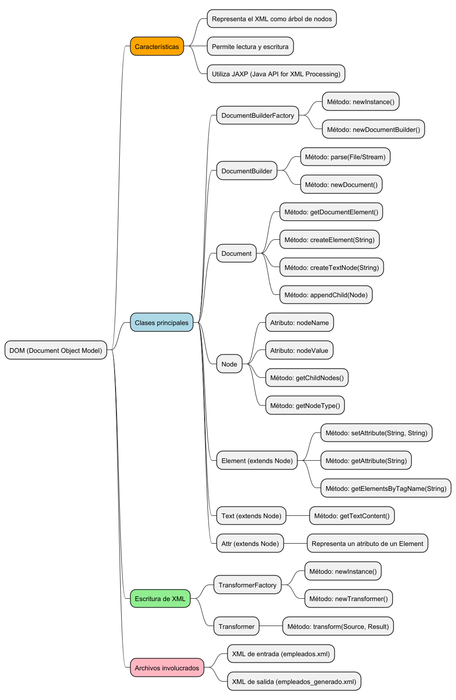
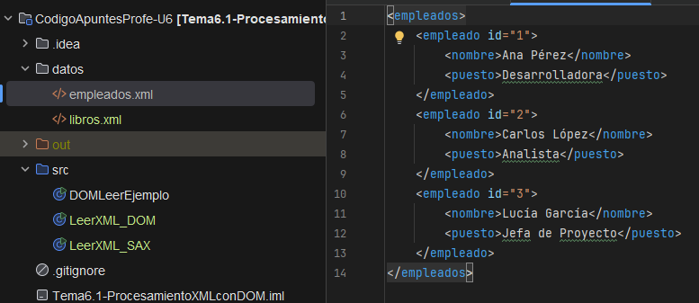
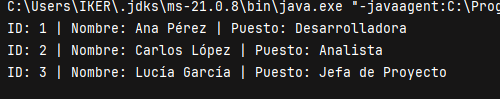
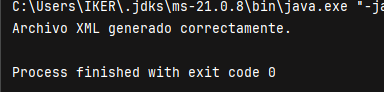

**Descripción**  
Esta unidad profundiza en el uso del modelo DOM para la lectura, análisis, modificación y escritura de documentos XML en Java. Se estudian las clases fundamentales, su estructura jerárquica, y se realizan ejercicios paso a paso para manipular nodos, atributos y contenido textual.




## ¿Qué es DOM?

DOM (Document Object Model) es un modelo de estructura de árbol en memoria que representa todos los elementos de un documento XML como nodos organizados jerárquicamente.

- Cada elemento, atributo o contenido textual es un nodo.
    
- Permite acceso aleatorio, lectura, modificación y escritura.
    
- Utiliza la API estándar de Java JAXP (`javax.xml.parsers`, `org.w3c.dom`, `javax.xml.transform`).


## Clases principales y su uso

|Clase|Descripción|
|---|---|
|`DocumentBuilderFactory`|Crea instancias para analizar XML|
|`DocumentBuilder`|Construye un `Document` desde un archivo|
|`Document`|Representa todo el documento XML|
|`Node`|Nodo genérico (base de todos los nodos)|
|`Element`|Nodo que representa una etiqueta XML|
|`Attr`|Nodo atributo de un elemento|
|`Text`|Nodo que contiene texto|
|`TransformerFactory`|Crea transformadores para escribir XML|
|`Transformer`|Transforma `Document` a fichero de salida|


## Lectura de un documento XML con DOM

```java
import javax.xml.parsers.*;
import org.w3c.dom.*;
import java.io.File;

public class DOMLeerEjemplo {
    public static void main(String[] args) {
        try {
            File archivo = new File("datos/empleados.xml");
            DocumentBuilderFactory dbf = DocumentBuilderFactory.newInstance();
            DocumentBuilder db = dbf.newDocumentBuilder();
            Document doc = db.parse(archivo);

            NodeList lista = doc.getElementsByTagName("empleado");

            for (int i = 0; i < lista.getLength(); i++) {
                Element emp = (Element) lista.item(i);
                String id = emp.getAttribute("id");
                String nombre = emp.getElementsByTagName("nombre").item(0).getTextContent();
                String puesto = emp.getElementsByTagName("puesto").item(0).getTextContent();
                System.out.println("ID: " + id + " | Nombre: " + nombre + " | Puesto: " + puesto);
            }

        } catch (Exception e) {
            System.out.println("Error al leer: " + e.getMessage());
        }
    }
}
```

Aquí igual, hay que crear el archivo empleados.xml y meterlo dentro de la carpeta datos para que funcione, y poner los nombres de los nodos los mismos que los del código, porque si no nos dará error.



Y esto te saldrá por consola.




## Escritura de un documento XML con DOM

```java
import javax.xml.parsers.*;
import javax.xml.transform.*;
import javax.xml.transform.dom.DOMSource;
import javax.xml.transform.stream.StreamResult;
import org.w3c.dom.*;
import java.io.File;

public class DOMEscribirEjemplo {
    public static void main(String[] args) {
        try {
            DocumentBuilderFactory dbf = DocumentBuilderFactory.newInstance();
            DocumentBuilder db = dbf.newDocumentBuilder();
            Document doc = db.newDocument();

            Element root = doc.createElement("empleados");
            doc.appendChild(root);

            Element emp = doc.createElement("empleado");
            emp.setAttribute("id", "E001");

            Element nombre = doc.createElement("nombre");
            nombre.appendChild(doc.createTextNode("Ana Torres"));
            emp.appendChild(nombre);

            Element puesto = doc.createElement("puesto");
            puesto.appendChild(doc.createTextNode("Desarrolladora"));
            emp.appendChild(puesto);

            root.appendChild(emp);

            TransformerFactory tf = TransformerFactory.newInstance();
            Transformer transformer = tf.newTransformer();
            DOMSource source = new DOMSource(doc);
            StreamResult result = new StreamResult(new File("datos/empleados_generado.xml"));
            transformer.transform(source, result);

            System.out.println("Archivo XML generado correctamente.");

        } catch (Exception e) {
            System.out.println("Error al escribir: " + e.getMessage());
        }
    }
}
```

Este codigo nos generara directamente el archivo xml




## Esquema del flujo de trabajo DOM

1. Crear un `DocumentBuilderFactory`
    
2. Obtener un `DocumentBuilder`
    
3. Analizar el XML y obtener un `Document`
    
4. Navegar con `getElementsByTagName`, `getAttribute`, `getChildNodes`
    
5. Modificar con `createElement`, `appendChild`, `setAttribute`
    
6. Guardar con `Transformer` (usando `DOMSource` y `StreamResult`)
    

## Archivos utilizados

- Entrada: `datos/empleados.xml`
    
- Salida: `datos/empleados_generado.xml`
    

Puedes usar el siguiente contenido de ejemplo como archivo de entrada:
```xml
<empleados>
    <empleado id="E101">
        <nombre>Juan Pérez</nombre>
        <puesto>Analista</puesto>
    </empleado>
    <empleado id="E102">
        <nombre>María López</nombre>
        <puesto>Diseñadora</puesto>
    </empleado>
</empleados>
```

## Resumen

El modelo DOM permite trabajar con documentos XML en memoria de forma jerárquica y flexible. Es ideal cuando se necesita leer, modificar y volver a guardar el documento completo. Sus métodos permiten recorrer nodos, crear elementos y atributos, y generar nuevos archivos XML.
