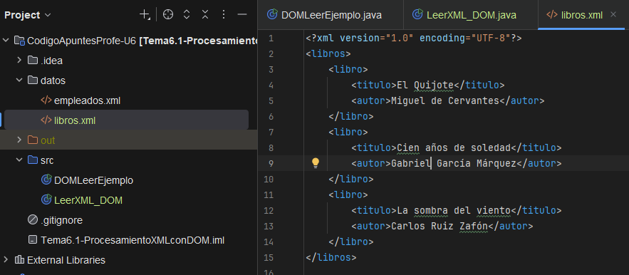
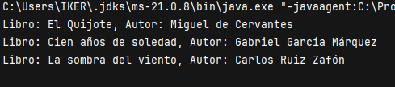
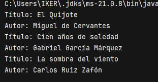

XML (eXtensible Markup Language) es un formato estándar para almacenar y transmitir datos estructurados. Es ampliamente usado en interoperabilidad de aplicaciones, configuraciones, intercambio de información entre sistemas y servicios web.

Java proporciona múltiples formas de manipular XML, dependiendo de si necesitamos procesar todo el documento en memoria o manejar grandes volúmenes de datos línea por línea.


## Tecnologías para procesar XML en Java

|Tecnología|Descripción breve|Ventajas|Inconvenientes|
|---|---|---|---|
|DOM (Document Object Model)|Carga el XML completo en memoria como un árbol|Acceso aleatorio, permite modificar el XML|Alto consumo de memoria|
|SAX (Simple API for XML)|Analiza el XML como flujo de eventos|Bajo consumo de memoria|No permite modificar ni navegar hacia atrás|
|StAX|Permite lectura y escritura controlada de eventos|Control completo, combinación de SAX y DOM|Mayor complejidad en el código|
|JAXP|API general para procesar XML con DOM o SAX|Flexible y estándar|Requiere conocer el modelo subyacente|
|JAXB|Permite mapear clases Java a XML y viceversa|Muy productivo con anotaciones|Requiere XSD y configuración previa|
|XPath|Lenguaje para buscar nodos dentro de un XML|Precisión, potente en combinación con DOM|Solo lectura|

## Estructura de un XML de ejemplo

```xml
<libros>
    <libro>
        <titulo>Java Avanzado</titulo>
        <autor>Juan Pérez</autor>
    </libro>
    <libro>
        <titulo>XML en Java</titulo>
        <autor>Ana Gómez</autor>
    </libro>
</libros>
```


## Lectura de XML con DOM

```java
import javax.xml.parsers.DocumentBuilderFactory;
import javax.xml.parsers.DocumentBuilder;
import org.w3c.dom.*;

import java.io.File;

public class LeerXML_DOM {
    public static void main(String[] args) {
        try {
            File archivo = new File("datos/libros.xml");
            DocumentBuilderFactory factory = DocumentBuilderFactory.newInstance();
            DocumentBuilder builder = factory.newDocumentBuilder();
            Document doc = builder.parse(archivo);

            NodeList lista = doc.getElementsByTagName("libro");
            for (int i = 0; i < lista.getLength(); i++) {
                Element libro = (Element) lista.item(i);
                String titulo = libro.getElementsByTagName("titulo").item(0).getTextContent();
                String autor = libro.getElementsByTagName("autor").item(0).getTextContent();
                System.out.println("Libro: " + titulo + ", Autor: " + autor);
            }

        } catch (Exception e) {
            System.out.println("Error: " + e.getMessage());
        }
    }
}
```

Para que nos vaya tendremos que crear el archivo libros.xml dentro de la carpeta datos.


 Y un vez hayamos creado y escrito el XML, ejecutamos la  clase y nos mostrara los datos del XML




## Lectura con SAX (manejador de eventos)

```java
import javax.xml.parsers.SAXParser;
import javax.xml.parsers.SAXParserFactory;
import org.xml.sax.*;
import org.xml.sax.helpers.DefaultHandler;
import java.io.File;

public class LeerXML_SAX {
    public static void main(String[] args) {
        try {
            File archivo = new File("datos/libros.xml");
            SAXParserFactory factory = SAXParserFactory.newInstance();
            SAXParser parser = factory.newSAXParser();

            DefaultHandler handler = new DefaultHandler() {
                boolean titulo = false;
                boolean autor = false;

                public void startElement(String uri, String localName, String qName, Attributes attributes) {
                    if (qName.equals("titulo")) titulo = true;
                    if (qName.equals("autor")) autor = true;
                }

                public void characters(char[] ch, int start, int length) {
                    if (titulo) {
                        System.out.println("Título: " + new String(ch, start, length));
                        titulo = false;
                    }
                    if (autor) {
                        System.out.println("Autor: " + new String(ch, start, length));
                        autor = false;
                    }
                }
            };

            parser.parse(archivo, handler);
        } catch (Exception e) {
            System.out.println("Error SAX: " + e.getMessage());
        }
    }
}
```

Aquí no tendremos que crear el archivo porque ya esta creado, lo que hace es mostrárnoslo de otra manera




## Resumen

Java ofrece distintas estrategias para leer y manipular XML. La elección depende de:

- Si necesitamos leer o modificar el XML.
    
- El tamaño del archivo y la eficiencia requerida.
    
- El uso de herramientas como XSD, anotaciones y POJOs.

## Tabla comparativa

|Tecnología|Memoria|Modificación|Precisión|Complejidad|
|---|---|---|---|---|
|DOM|Alta|Sí|Media|Baja|
|SAX|Baja|No|Media|Media|
|StAX|Media|Sí (eventos)|Alta|Alta|
|JAXB|Media|Sí (POJO)|Alta|Baja|
|XPath|Media|No|Muy alta|Media|
