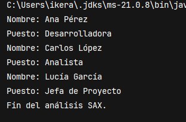

**Descripción**  
En esta unidad se estudia SAX, un modelo de procesamiento de XML basado en eventos, que permite analizar documentos XML de forma secuencial, sin cargarlos completamente en memoria. Es ideal para ficheros grandes o cuando no es necesario modificar el contenido del documento.


## ¿Qué es SAX?

SAX (Simple API for XML) es un modelo de lectura secuencial de XML que genera eventos cada vez que se encuentra un nodo, un texto o un cierre de etiqueta. A diferencia de DOM, no mantiene en memoria el árbol completo del documento.

- Procesamiento eficiente, bajo consumo de memoria.
    
- Solo lectura, no permite modificar ni recorrer hacia atrás.
    
- Basado en una clase manejadora de eventos (`DefaultHandler`).


## Clases clave

|Clase|Descripción|
|---|---|
|`SAXParserFactory`|Fábrica para crear un parser SAX|
|`SAXParser`|Parser que interpreta el documento y dispara eventos|
|`DefaultHandler`|Clase base donde se definen los métodos que responden a los eventos|

## Eventos principales

|Método|Momento de ejecución|
|---|---|
|`startDocument()`|Al inicio del documento|
|`startElement(...)`|Cuando se abre una etiqueta|
|`characters(char[], int, int)`|Cuando se detecta contenido|
|`endElement(...)`|Cuando se cierra una etiqueta|
|`endDocument()`|Al finalizar el documento|

## Flujo de uso de SAX en Java

1. Crear un `SAXParserFactory`.
    
2. Obtener un `SAXParser`.
    
3. Definir una clase que herede de `DefaultHandler`.
    
4. Implementar los métodos `startElement`, `characters`, etc.
    
5. Llamar a `parse()` pasando el archivo y el handler.


## Ejemplo completo de uso de SAX

```java
import javax.xml.parsers.SAXParser;
import javax.xml.parsers.SAXParserFactory;
import org.xml.sax.*;
import org.xml.sax.helpers.DefaultHandler;
import java.io.File;

public class SAXEjemplo {
    public static void main(String[] args) {
        try {
            File archivo = new File("datos/empleados.xml");
            SAXParserFactory factory = SAXParserFactory.newInstance();
            SAXParser parser = factory.newSAXParser();

            DefaultHandler handler = new DefaultHandler() {
                boolean nombre = false;
                boolean puesto = false;

                public void startElement(String uri, String localName, String qName, Attributes attributes) {
                    if (qName.equalsIgnoreCase("nombre")) nombre = true;
                    if (qName.equalsIgnoreCase("puesto")) puesto = true;
                }

                public void characters(char[] ch, int start, int length) {
                    if (nombre) {
                        System.out.println("Nombre: " + new String(ch, start, length));
                        nombre = false;
                    }
                    if (puesto) {
                        System.out.println("Puesto: " + new String(ch, start, length));
                        puesto = false;
                    }
                }

                public void endDocument() {
                    System.out.println("Fin del análisis SAX.");
                }
            };

            parser.parse(archivo, handler);
        } catch (Exception e) {
            System.out.println("Error SAX: " + e.getMessage());
        }
    }
}
```



## Comparativa con DOM

|Característica|SAX|DOM|
|---|---|---|
|Memoria|Muy baja|Alta|
|Tipo de acceso|Secuencial|Aleatorio (árbol completo)|
|Permite modificar XML|No|Sí|
|Complejidad|Media|Baja|
|Ideal para|Lectura de archivos grandes|Manipulación estructurada|
## Resumen

SAX permite procesar XML de forma rápida y eficiente sin necesidad de cargarlo completamente. Es ideal cuando se necesita leer información puntual o cuando se trabaja con grandes volúmenes de datos.