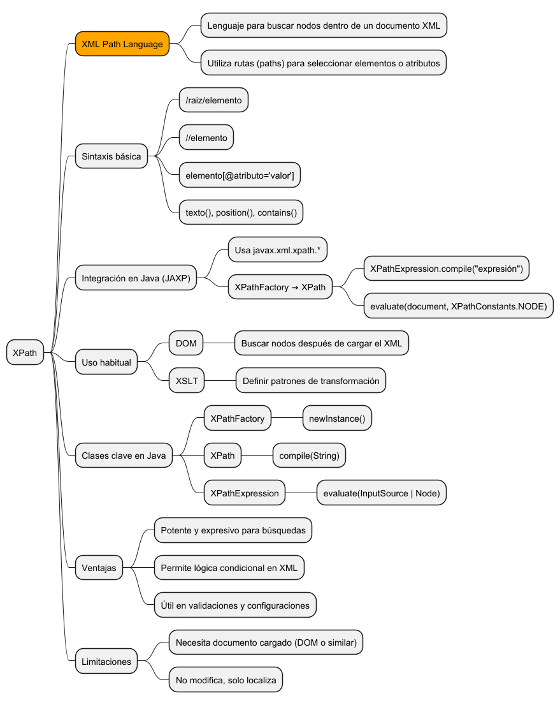
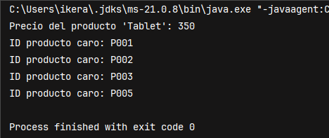

**Descripción**  
XPath (XML Path Language) es un lenguaje de navegación y consulta sobre documentos XML. Esta unidad profundiza en su uso desde Java, especialmente en combinación con DOM y JAXP. Veremos su sintaxis, operadores, funciones comunes y cómo integrarlo correctamente en proyectos Java.





## ¿Qué es XPath?

XPath permite localizar nodos (elementos, atributos, texto) dentro de documentos XML a partir de expresiones que representan rutas y condiciones.

Se usa habitualmente en:

- DOM → para seleccionar nodos tras cargar el XML.
    
- XSLT → para aplicar transformaciones.
    
- Validaciones → reglas condicionales en estructuras XML.
    

## Sintaxis básica de XPath

|Expresión|Significado|
|---|---|
|`/libros/libro`|Todos los nodos `<libro>` hijos de `<libros>`|
|`//titulo`|Todos los nodos `<titulo>` en todo el documento|
|`//libro[1]`|Primer nodo `<libro>` en cualquier parte del XML|
|`//libro[@id='L002']`|Nodo `<libro>` cuyo atributo id es “L002”|
|`//libro[titulo='Java']`|Libro cuyo hijo `<titulo>` tiene el valor «Java»|
|`//libro[position()=last()]`|Último libro en la colección|

## Clases clave en Java para XPath

|Clase|Descripción|
|---|---|
|`XPathFactory`|Crea instancias de objetos XPath|
|`XPath`|Evaluador de expresiones XPath|
|`XPathExpression`|Expresión compilada lista para evaluación|
|`XPathConstants`|Constantes de tipos de resultado (STRING, NODE, NODESET…)|

## Funciones XPath comunes

- `text()` → devuelve el contenido textual de un nodo
    
- `@atributo` → selecciona un atributo
    
- `position()` → devuelve la posición dentro del nodo padre
    
- `last()` → selecciona el último nodo
    
- `contains()` → busca coincidencia parcial
    
- `starts-with()` → filtro por prefijo
    

## Ejemplo práctico en Java

```java
import javax.xml.parsers.*;
import javax.xml.xpath.*;
import org.w3c.dom.*;

import java.io.File;

public class XPathAvanzado {
    public static void main(String[] args) {
        try {
            File archivo = new File("datos/catalogo.xml");

            DocumentBuilderFactory factory = DocumentBuilderFactory.newInstance();
            DocumentBuilder builder = factory.newDocumentBuilder();
            Document doc = builder.parse(archivo);

            XPathFactory xpf = XPathFactory.newInstance();
            XPath xpath = xpf.newXPath();

            // Buscar el precio del producto con nombre "Tablet"
            String precio = xpath.evaluate("//producto[nombre='Tablet']/precio/text()", doc);
            System.out.println("Precio del producto 'Tablet': " + precio);

            // Obtener los IDs de todos los productos que cuestan más de 100
            XPathExpression expr = xpath.compile("//producto[precio>100]/@id");
            NodeList nodos = (NodeList) expr.evaluate(doc, XPathConstants.NODESET);

            for (int i = 0; i < nodos.getLength(); i++) {
                System.out.println("ID producto caro: " + nodos.item(i).getTextContent());
            }

        } catch (Exception e) {
            System.out.println("Error XPath: " + e.getMessage());
        }
    }
}
```





## Ventajas de XPath

- Muy expresivo y potente para búsquedas complejas.
    
- Permite lógica condicional (filtrado, selección por atributos).
    
- Reduce líneas de código frente a recorrer manualmente DOM.
    
- Compatible con validadores, XSLT, JAXB y DOM.
    

## Limitaciones

- No modifica XML, solo localiza nodos.
    
- Requiere el documento cargado en memoria (DOM o similar).
    
- El uso intensivo de XPath sobre documentos muy grandes puede ser menos eficiente que SAX.
    

## Resumen

XPath es una herramienta esencial en la manipulación de XML moderna. Su integración en Java mediante JAXP y DOM permite acceder a nodos y atributos de forma sencilla y potente. Su conocimiento es indispensable en el desarrollo profesional con XML.